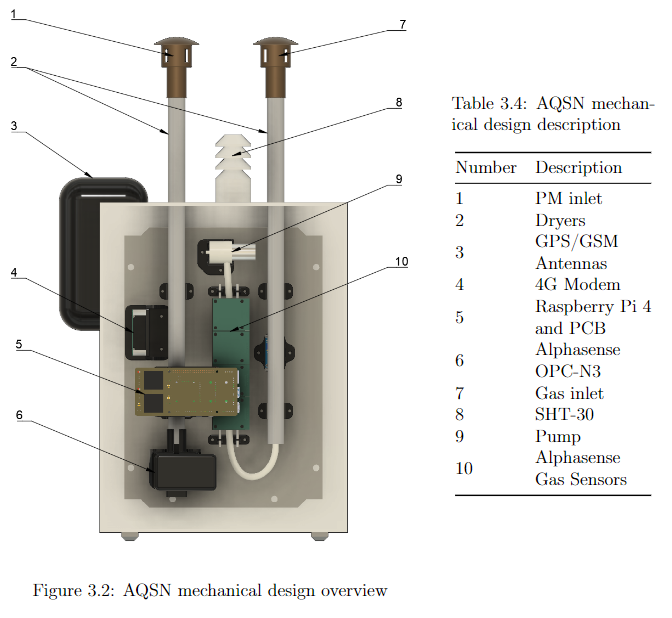

# air_node
 Software package and hardware for a BalenaOS based air quality sensor node featuring cellular networking, 
 MQTT, GPS localisation, local USB drive data logging and support for the following sensors:
 
 - Alphasense OPC-N3 PM Sensor
 - 2xADS1115 connected to NO-B4,CO-B4,OX-B431,NO2-B43 Alphasense ISBs
 - HYT221 Temperature/Humidity Sensor
 - SHT3x Temperature/Humidity Sensor

Hardware used during developement:

 - Raspberry Pi 4
 - SIM7600 4G Modem/GPS receiver
 - USB Stick for local data storage (needs to be vfat formatted)

Configuration can be done via BalenaCloud environment variables or in src/config_cloudless.py if no cloud will be used.

